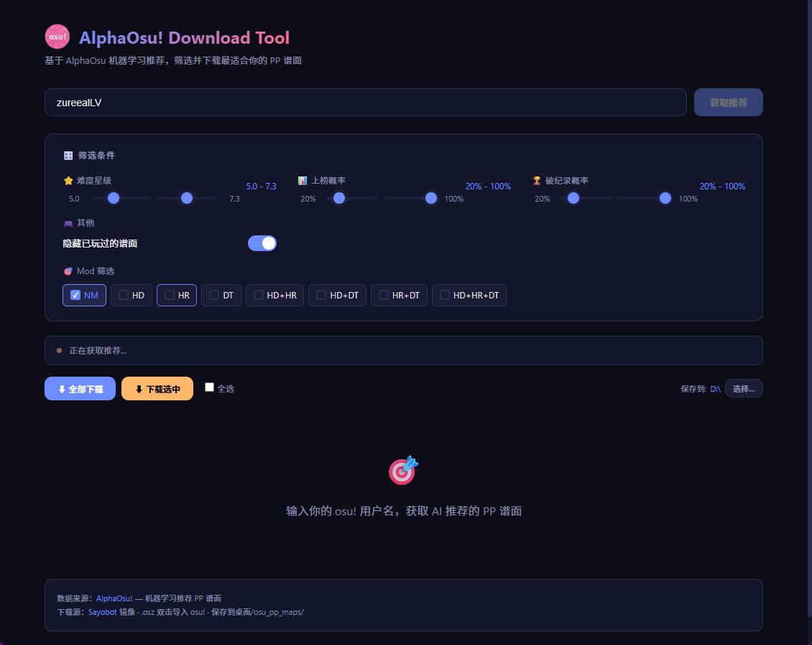
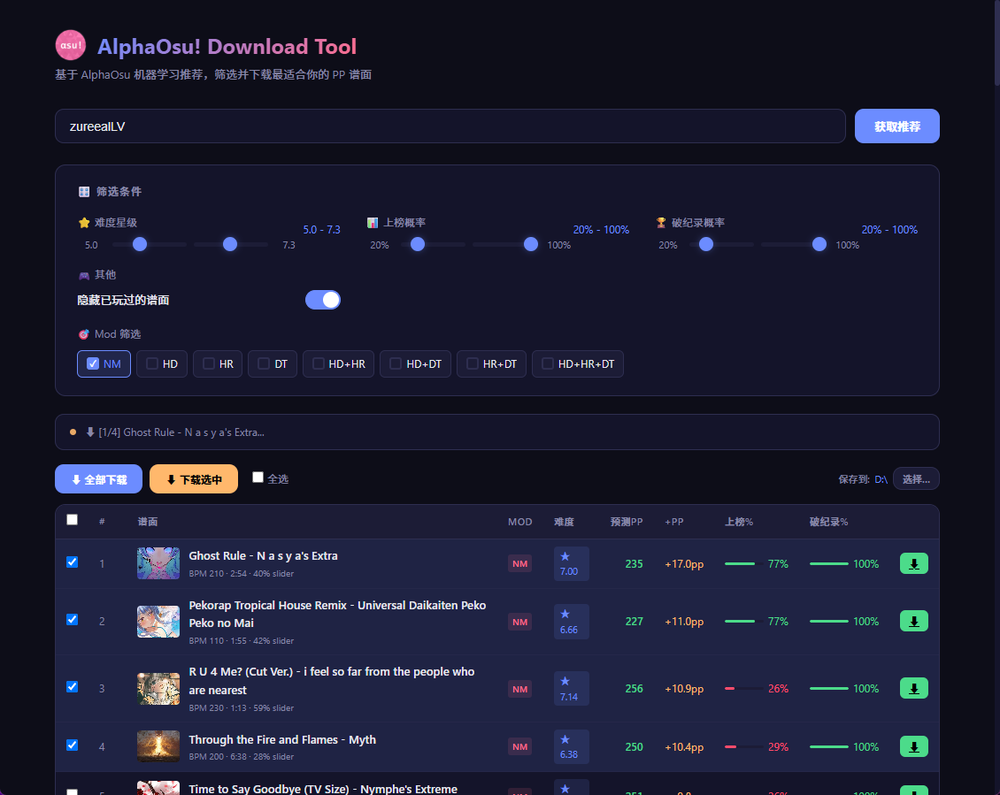

<p align="center">
  
</p>

<h1 align="center">AlphaOsu! Download Tool</h1>

<p align="center">
  <strong>基于机器学习推荐的 osu! 谱面批量下载工具</strong>
</p>

<p align="center">
  
  
  
  
</p>

---

## ✨ Features

```
🎵 AlphaOsu ML 推荐引擎        →  个性化 PP 谱面推荐
⭐ 星数 / Mod / 概率筛选        →  精准定位你的练习区间
🖼️ 谱面封面预览                 →  一眼认出是哪首歌
☑️ 多选 + 批量下载              →  勾选想要的一键全下
📁 自定义保存目录               →  直接下到 osu! Songs 文件夹
⬇️ Sayobot 镜像源               →  国内高速下载，免登录
```

## 📸 Screenshots

<p align="center">
  
  &nbsp;&nbsp;
  
</p>
<p align="center">
  
</p>

## 🚀 Quick Start

### 下载 EXE

从 [Releases](../../releases) 下载 `AlphaOsuDownloadTool.exe`，双击运行。

### 从源码运行

```bash
git clone https://github.com/zureealLV/AlphaOsu-Download-Tool.git
cd AlphaOsu-Download-Tool
pip install pywebview
python main.py
```

### 打包

```bash
pip install pyinstaller
pyinstaller --onefile --windowed --icon=icon.ico --name "AlphaOsuDownloadTool" main.py
```

## 🏗️ Architecture

```
┌─────────────────────────────────────────┐
│          PyWebView Native Window         │
│  ┌───────────────────────────────────┐  │
│  │     HTML / CSS / JavaScript       │  │
│  │  (筛选 · 表格 · 封面图 · 交互)     │  │
│  └──────────┬────────────────────────┘  │
│             │  window.pywebview.api      │
│  ┌──────────▼────────────────────────┐  │
│  │        Python Backend             │  │
│  │  login() · get_page() · download()│  │
│  └──────────┬────────────────────────┘  │
└─────────────┼───────────────────────────┘
              │ HTTPS
    ┌─────────▼─────────┐
    │   AlphaOsu API    │  ← ML 推荐数据
    └───────────────────┘
    ┌───────────────────┐
    │  Sayobot Mirror   │  ← .osz 下载
    └───────────────────┘
```

## 🎮 Usage

1. 输入你的 osu! 用户名，点击「获取推荐」
2. 调整筛选条件（星数、Mod、上榜概率等）
3. 勾选想要的谱面，或直接「全部下载」
4. .osz 文件双击即可导入 osu!

## 🙏 Credits

- [AlphaOsu](https://alphaosu.keytoix.vip/) — 机器学习 PP 推荐引擎
- [Sayobot](https://sayobot.cn/) — osu! 谱面下载镜像
- [PyWebView](https://pywebview.flowrl.com/) — 轻量级桌面 GUI 框架

---

<p align="center">
  <sub>Made with 💜 for the osu! community</sub>
</p>
